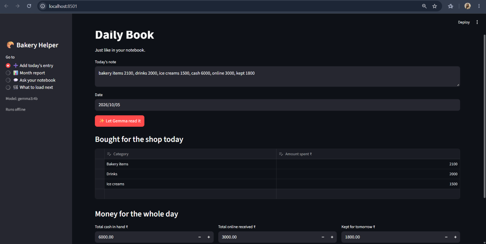
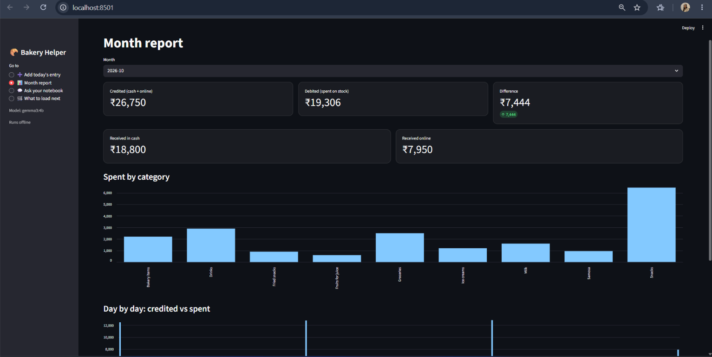
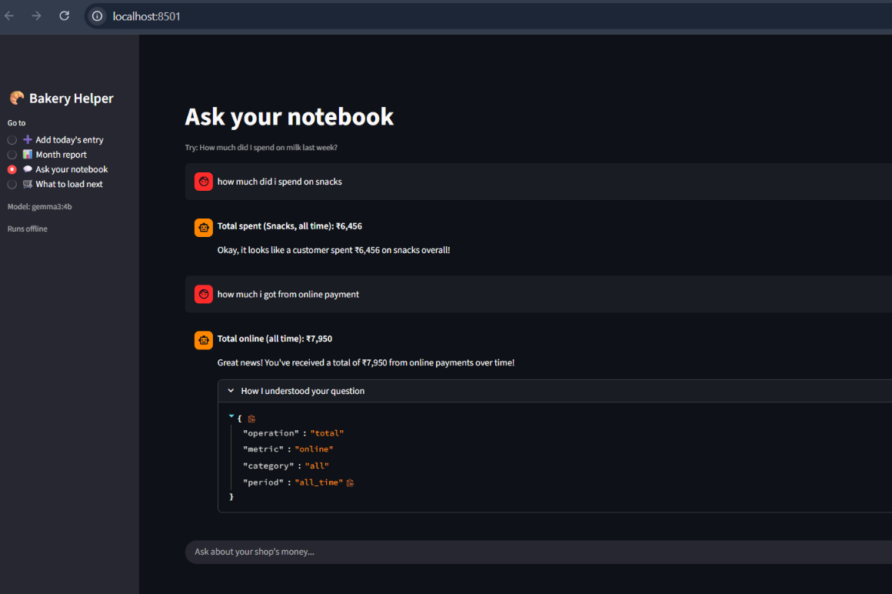
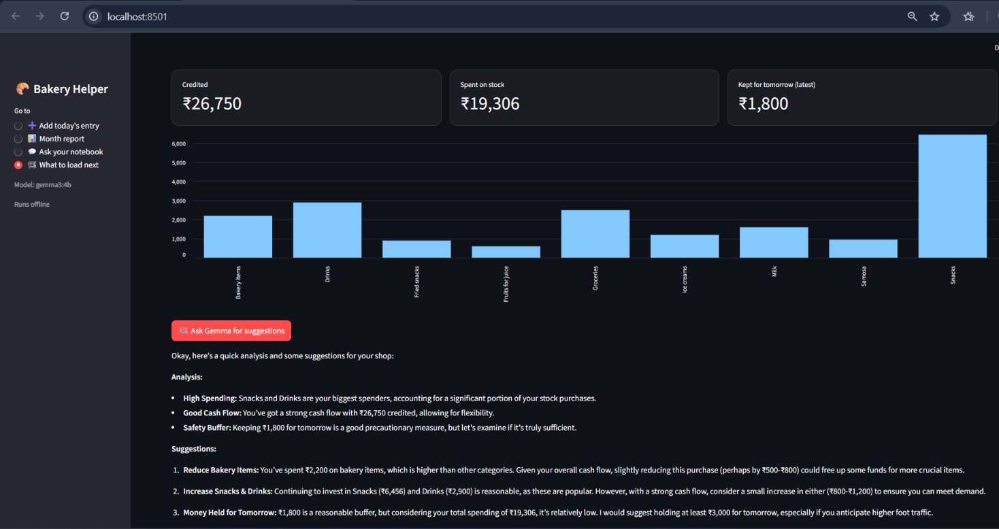

# Bakery Daily Helper

A tool I built for my father's small local bakery. He keeps a daily notebook of what he buys for the shop, the cash and online money he receives, and what he keeps for tomorrow. He types the day's note in plain English, and Gemma fills in the table. He can also ask questions like "how much did I spend on milk last week?"

Built for Hacktoberfest Weekend DEV Challenge: Build for a Friend  -
Build something with open-source AI at its core

## How the AI is used
- Gemma (open-weight, by Google) runs locally through Ollama.
- It reads the daily note into a table, and turns questions into queries.
- Python (pandas) does all the maths, so numbers are always exact.

## Why open-weight
Private (shop data never leaves the laptop), free, and works offline.

## Run it
1. Install Ollama (https://ollama.com), then run: ollama pull gemma3:4b
2. pip install -r requirements.txt
3. streamlit run app.py
4. To try it with fake data, copy the two files from sample_data into the main folder.

## Screenshots

### Daily Book

### Month report

### Ask your notebook

### What to load next

## Limits
- Small models can misread notes, so the app shows a table to check before saving.
- Cash and online are whole-day totals, so income per category isn't tracked.
- Runs locally.